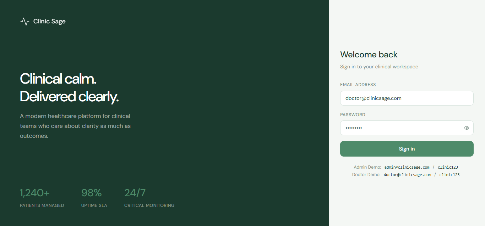
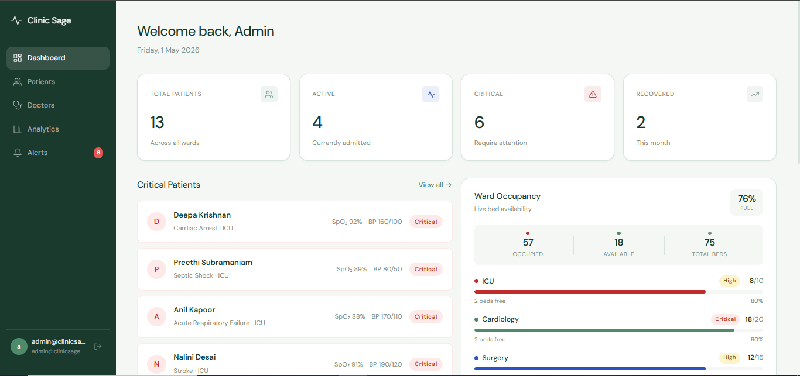
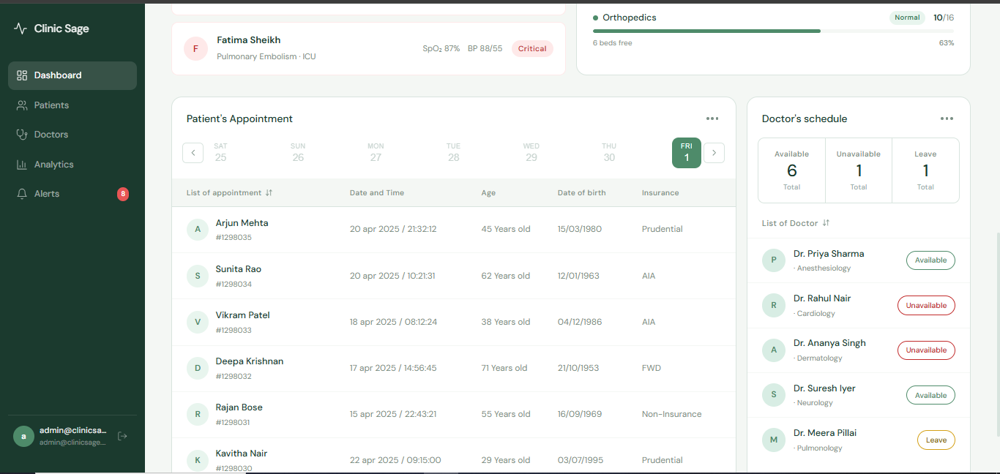
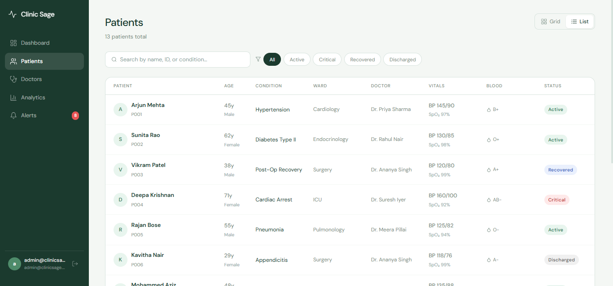
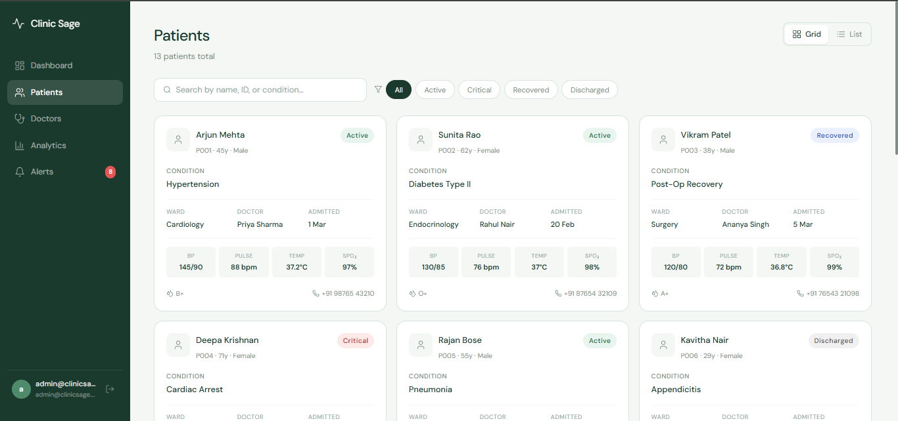
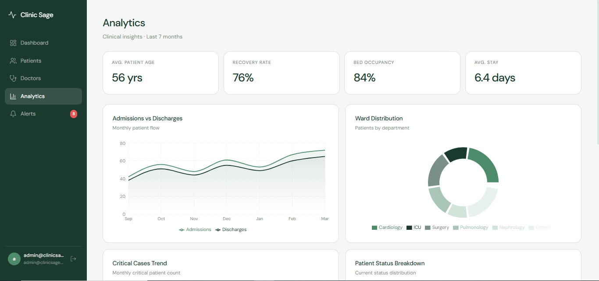
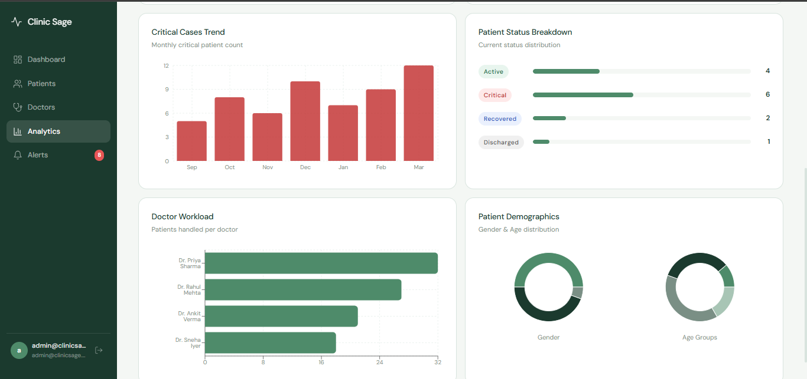
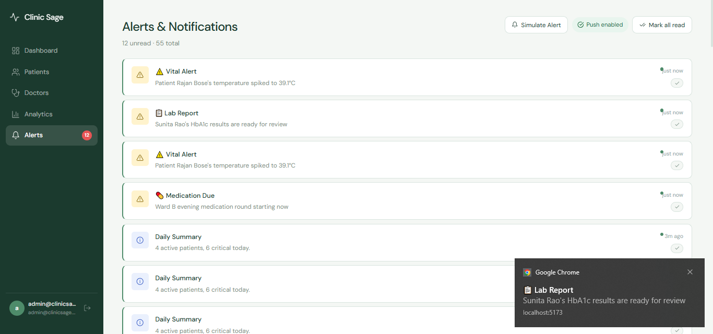

# 🌿 Clinic Sage — Healthcare SaaS Platform (Frontend Architecture)

**Designed with scalability, modularity, and production-readiness in mind.**

Clinic Sage is a modern B2B healthcare platform built using **React, TypeScript, and Redux Toolkit**, featuring patient management, analytics dashboards, role-based access, and real-time notifications powered by Service Workers.

---

## 🚀 Quick Start

```bash
npm install
npm run dev
```

Open: [http://localhost:5173](http://localhost:5173)

### Demo Accounts

| Role   | Email                 | Password  |
| ------ | --------------------- | --------- |
| Admin  | admin@clinicsage.com  | clinic123 |
| Doctor | doctor@clinicsage.com | clinic123 |

---

## 🧩 Core Modules

### 🔐 Authentication

- Login with validation and error handling
- Role-based access control (**Admin / Doctor**)
- Session persistence (mock + Firebase-ready)
- Protected routes with automatic redirects

---

### 📊 Dashboard

- KPI stats (patients, active, critical, recovery)
- Critical patient & Ward occupancy
- Appointments & doctor availability insights
- Doctor schedule panel (**Admin only**)
- Deep linking:
  - Stats → filtered patient/doctor views
  - Critical patients → **scroll & highlight**
  - Doctor schedule list → **scroll & highlight**

---

### 🧑‍⚕️ Patients & Doctors

- Grid & List views (responsive switching)
- Search (name, ID, condition)
- Status-based filtering
- Highlight + scroll navigation from dashboard
- Reusable entity components (card + row)

---

### 📈 Analytics

- Built with **Recharts**
- Area → Admissions vs Discharges
- Bar → Critical trends
- Pie / Donut → Distribution insights
- Horizontal bars → Doctor workload (**Admin only**)

---

### 🔔 Notifications

- Service Worker powered local notifications
- Permission handling
- Mark as read / mark all read
- Simulated alerts for demo

---

## 📸 Screenshots

### Login
| Login |
|------|
|  |

---

### Dashboard
| Dashboard | Dashboard |
|----------|----------|
|  |  |

---

### Patient / Doctor
| List View | Grid View |
|----------|----------|
|  |  |

---

### Analytics
| Chart 1 | Chart 2 |
|--------|--------|
|  |  |

---

### Alerts
| Alerts |
|--------|
|  |

## 📁 Project Structure

```
src/
├── components/           # Shared UI (layout, common, reusable entities)
├── features/             # Domain modules (patients, doctors)
├── pages/                # Route-level pages
├── store/                # Redux Toolkit slices
├── hooks/                # Typed Redux hooks
├── utils/                # Services, Firebase, mock data
├── styles/               # Global design system
├── sw.ts                 # Service Worker
└── App.tsx               # App entry (routing + providers)
```

---

## 🧠 Architecture Overview

### Hybrid Feature-Oriented Design

The application follows a **hybrid architecture** combining feature-based modules with route-level pages:

#### Feature Modules (Domain-driven)

- `features/patients`
- `features/doctors`

Each feature encapsulates:

- UI components
- State (Redux slice)
- Domain logic

#### Page Modules (Route-level composition)

- `pages/analytics`
- `pages/notifications`
- `pages/dashboard`

These pages aggregate data and shared components rather than owning full feature boundaries.

---

### Why this approach?

- Keeps routing simple and easy to scale
- Avoids over-engineering for smaller modules
- Allows gradual migration to full feature-based architecture

---

### Scalability Path

If the application grows, remaining pages can be migrated into full feature modules:

- `features/analytics`
- `features/notifications`

This ensures consistency and enables micro-frontend readiness without immediate complexity.

---

### State Management (Redux Toolkit)

- `authSlice` → authentication & user session
- `patientSlice` → list, filters, view mode
- `notificationSlice` → notifications + read state

---

### Auth Abstraction (`authService.ts`)

Provides a clean boundary between UI and backend:

- Mock authentication for local dev
- Firebase integration for production
- Single swap point → no UI changes needed

---

## ⚡ Performance Considerations

- `useMemo` for filtered patient lists
- `React.memo` for row/card components
- `useCallback` for stable handlers
- Responsive fallback (grid enforced on small screens)

#### Future Improvements

- Virtualized lists (`react-window`) for large datasets
- API caching via RTK Query
- Code-splitting for route-level chunks

---

## 🧩 Micro-Frontend Readiness

The current structure aligns with micro-frontend boundaries:

### Potential Split

- `patients-app`
- `doctors-app`
- `analytics-app`
- `notifications-app`

### Shared Modules

- Design system (CSS tokens)
- Auth layer
- Layout shell

This allows:

- Independent deployments
- Team ownership per feature
- Reduced coupling

---

## 🎨 Design System

Defined using CSS variables in `global.css`:

| Token         | Usage               |
| ------------- | ------------------- |
| `--primary`   | Headers, sidebar    |
| `--secondary` | Metadata, captions  |
| `--tertiary`  | CTAs, active states |
| `--neutral`   | Backgrounds         |
| `--surface`   | Cards, panels       |

Typography: **DM Sans**  
Style: Minimal, flat, clinical UI

---

## 🔄 Service Worker Flow

```
User Action → sendLocalNotification()
            → Service Worker receives message
            → showNotification()
            → Browser displays native notification
```

---

## 🛠️ Scripts

| Command           | Description                   |
| ----------------- | ----------------------------- |
| `npm run dev`     | Start dev server              |
| `npm run build`   | Type-check + production build |
| `npm run preview` | Preview production build      |

---

## 📌 Key Highlights

- Clean, scalable architecture
- Role-based UI + route protection
- Deep-link navigation between modules
- Strong separation of concerns
- Firebase-ready authentication
- PWA-ready (Service Worker enabled)
- Fully responsive design

---

## 🚧 Future Enhancements

- Backend integration with real APIs
- Role-based permissions at API level (RBAC)
- Real-time updates via WebSockets
- Dark mode / theme system
- Advanced analytics (predictive insights)

---

## 📄 License

For assessment/demo purposes only.

---

## 💬 Final Note

This project focuses not just on UI implementation, but on **how a real-world SaaS frontend should be structured for scale, maintainability, and extensibility.**
